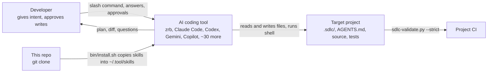
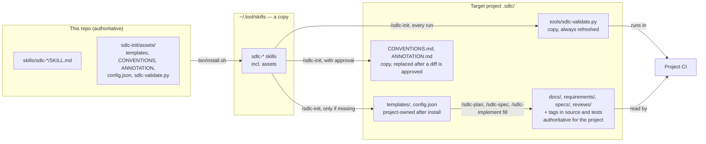
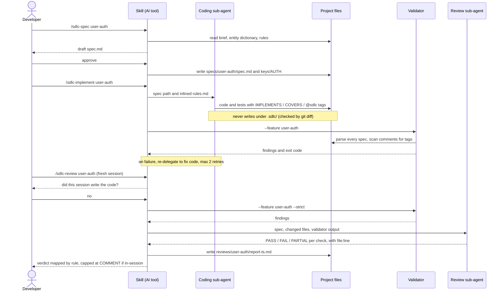
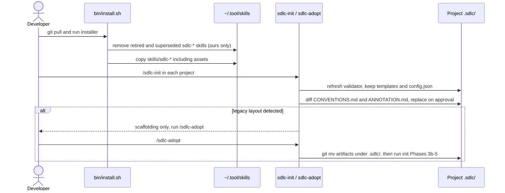

# Architecture: SDLC AI Plugin

## System Context

- **Developer** — gives the intent, answers the interview, and approves every write (see `.sdlc/CONVENTIONS.md` § Approval tiers).
- **AI coding tool** — any runtime that loads `SKILL.md` files. It carries out the workflow; this plugin ships no runtime of its own ([ADR-001](adr/ADR-001-chat-skills-not-a-cli.md)).
- **Target project** — holds every durable artifact. Chat history is never state.
- **Project CI** — runs the validator, the only automated enforcement point.

## Structure — artifact lifecycle

Nothing here is a running service; C4 containers don't apply. What matters is **where each artifact lives, which copy is authoritative, and which command refreshes a copy**. Stale copies are how this system goes wrong: an old validator in a project, a second install left at a superseded path.

| Copy | Lives at | Authoritative? | Refreshed by |
|------|----------|----------------|--------------|
| Skills and assets (source) | this repo, `skills/` | **Yes** — edit here, nowhere else | `git pull` |
| Installed skills | `~/.<tool>/skills/sdlc-*`, or a `--dir` target | No | `bin/install.sh` (also sweeps superseded install paths) |
| Templates, `config.json` | project `.sdlc/` | **Yes, for that project** | never overwritten; edit by hand |
| Validator | project `.sdlc/tools/` | No | `/sdlc-init`, every run |
| `CONVENTIONS.md`, `ANNOTATION.md` | project `.sdlc/` | No, unless the project appended to them | `/sdlc-init`, after an approved diff |
| Specs, docs, reviews, code tags | project `.sdlc/` and source tree | **Yes** — the traceability record | the skills, with approval |

## Components

### Skills

| Component | Responsibility | Dependencies |
|-----------|---------------|-------------|
| `sdlc-init` | Installs `.sdlc/` scaffolding; writes steering docs, `AGENTS.md`, `rules.md` | Asset bundle |
| `sdlc-plan` | Problem brief (`US-*`/`AC-*`/`NFR-*`), entity dictionary, ADRs, architecture | Steering docs, `rules.md` |
| `sdlc-spec` | One `spec.md` per feature: EARS requirements, design, test plan; claims a Feature Key | Problem brief, entity dictionary |
| `sdlc-implement` | Delegates the feature to one coding sub-agent; verifies tests, lint, validator ([ADR-011](adr/ADR-011-single-delegation-that-cannot-edit-the-spec.md)) | `spec.md`, `ANNOTATION.md`, validator |
| `sdlc-review` | Validator pass, then a fresh-context review sub-agent; verdict mapped by rule ([ADR-008](adr/ADR-008-rule-mapped-verdicts-and-review-independence.md)) | `spec.md`, rules, ADRs, validator |
| `sdlc-quickfix` | `ADDED/MODIFIED/REMOVED` delta, implemented and promoted into `spec.md` | `spec.md`, validator |
| `sdlc-adopt` | Relocates legacy artifacts, reverse-engineers specs, annotates code, completes setup ([ADR-010](adr/ADR-010-legacy-detection-by-content.md)) | Asset bundle, `sdlc-init` phases |

### Validator

| Component | Responsibility | Dependencies |
|-----------|---------------|-------------|
| `main` / `validate_project` | CLI; runs every check in order; `--feature` narrows findings, never the parse | all below |
| `load_config` | Merges `.sdlc/config.json` over built-in defaults; lists extend, a malformed config is an ERROR | — |
| `check_legacy_layout` | Reports artifacts still at pre-`.sdlc/` paths, detected by content | — |
| `parse_spec` / `check_spec_hygiene` / `check_ears_syntax` | Feature Key, active/removed IDs, exemption headings, test plan, EARS shape | `config` |
| `collect_traceability_tags` | Walks the tree, classifies files by role, extracts tags from real comments ([ADR-004](adr/ADR-004-tags-count-only-in-real-comments-in-the-right-file.md)) | `config` |
| `check_tag_targets` / `check_tag_roles` / `check_requirement_coverage` / `check_ac_citations` | Dangling and unkeyed tags; misplaced tags; `trace-*` and `plan-*`; AC citations against the brief | parsed specs, tags |
| `Report` / `emit_*_report` | Collects `(severity, check, message, location)`; prints text or JSON | — |

### Repository

| Part | Technology | Responsibility |
|------|-----------|----------------|
| Skills — `skills/sdlc-*/SKILL.md` (7) | Markdown prompts, Agent Skills frontmatter | Workflow per phase: interview, generate from templates, get approval, delegate, verify, hand off |
| Asset bundle — `skills/sdlc-init/assets/` | Markdown, JSON, Python | Everything installed into a project's `.sdlc/`: templates, `CONVENTIONS.md`, `ANNOTATION.md`, `config.json`, the validator ([ADR-007](adr/ADR-007-assets-ship-once-and-become-project-owned.md)) |
| Validator — `assets/tools/sdlc-validate.py` | Python 3.8+, stdlib only, one file | Parses specs and code tags; reports traceability, ID-hygiene and EARS findings; exit code is the gate ([ADR-003](adr/ADR-003-one-stdlib-validator-file.md)) |
| Installer — `bin/install.sh` | Bash 3.2-compatible | Copies skills into each tool's skills directory; removes retired skills and superseded install paths; never touches skills it doesn't own |
| Eval runner — `evals/run.py` + `evals/golden/` | Python stdlib, JSON checks | Lints golden cases; grades a skill's output against deterministic checks ([ADR-012](adr/ADR-012-deterministic-evals.md)) |
| Test suite — `tests/`, `bin/test.sh` | Python stdlib, Bash | Validator, eval-runner and installer tests, static checks on the prompts, and the `--strict` traceability gate over this repo; `bin/test.sh` is the single entry point for CI and `zrb skill test` |

## Key Decisions

| ADR | Title | Status |
|-----|-------|--------|
| [ADR-001](adr/ADR-001-chat-skills-not-a-cli.md) | Chat skills are the interface, not a CLI | Accepted |
| [ADR-002](adr/ADR-002-traceability-lives-in-the-code.md) | Traceability tags live in source and test comments | Accepted |
| [ADR-003](adr/ADR-003-one-stdlib-validator-file.md) | The validator is one stdlib-only Python file, copied into each project | Accepted |
| [ADR-004](adr/ADR-004-tags-count-only-in-real-comments-in-the-right-file.md) | A tag counts only in a real comment, in the right kind of file | Accepted |
| [ADR-005](adr/ADR-005-feature-keys-and-immutable-ids.md) | Feature Keys namespace per-feature IDs; IDs are immutable | Accepted |
| [ADR-006](adr/ADR-006-one-spec-per-feature-in-canonical-ears.md) | One `spec.md` per feature, in canonical uppercase EARS | Accepted |
| [ADR-007](adr/ADR-007-assets-ship-once-and-become-project-owned.md) | Assets ship once, inside `sdlc-init`, and become project-owned | Accepted |
| [ADR-008](adr/ADR-008-rule-mapped-verdicts-and-review-independence.md) | Review verdicts are mapped by rule and capped without independence | Accepted |
| [ADR-009](adr/ADR-009-exemptions-only-by-explicit-heading.md) | Coverage exemptions only by explicit, separate headings | Accepted |
| [ADR-010](adr/ADR-010-legacy-detection-by-content.md) | Legacy layouts are detected by content; `/sdlc-adopt` finishes their setup | Accepted |
| [ADR-011](adr/ADR-011-single-delegation-that-cannot-edit-the-spec.md) | Implementation is one delegation that may not edit the spec | Accepted |
| [ADR-012](adr/ADR-012-deterministic-evals.md) | Evals are deterministic checks, with no LLM judge | Accepted |

## Key Flows

The artifacts involved, and how IDs link them, are in [`entity-dictionary.md`](../requirements/entity-dictionary.md).

### Feature loop — spec to verdict

The flow the whole product exists for. The two things readers get wrong are marked: the sub-agent never writes `.sdlc/`, and review independence depends on the session, not the spec.

### Install and upgrade

Where users get lost: the installer updates the skills, but each project keeps its own copy of the validator until `/sdlc-init` runs there.

## Deployment

No servers. Nothing runs outside the developer's machine and their CI.

| Environment | Infrastructure | Strategy |
|-------------|---------------|----------|
| Developer machine | `git clone` + `bin/install.sh` into `~/.<tool>/skills/`, or `--dir` for a project-scoped copy checked into a repo | Upgrade = `git pull && bin/install.sh`, then `/sdlc-init` in each project to refresh its validator |
| This repo's CI | GitHub Actions, `ubuntu-latest`, Python 3.8 (the supported floor) | `bin/test.sh` on every push to `main` and every pull request |
| Target project's CI | Whatever the project uses | `python3 .sdlc/tools/sdlc-validate.py --strict` as a blocking step |
