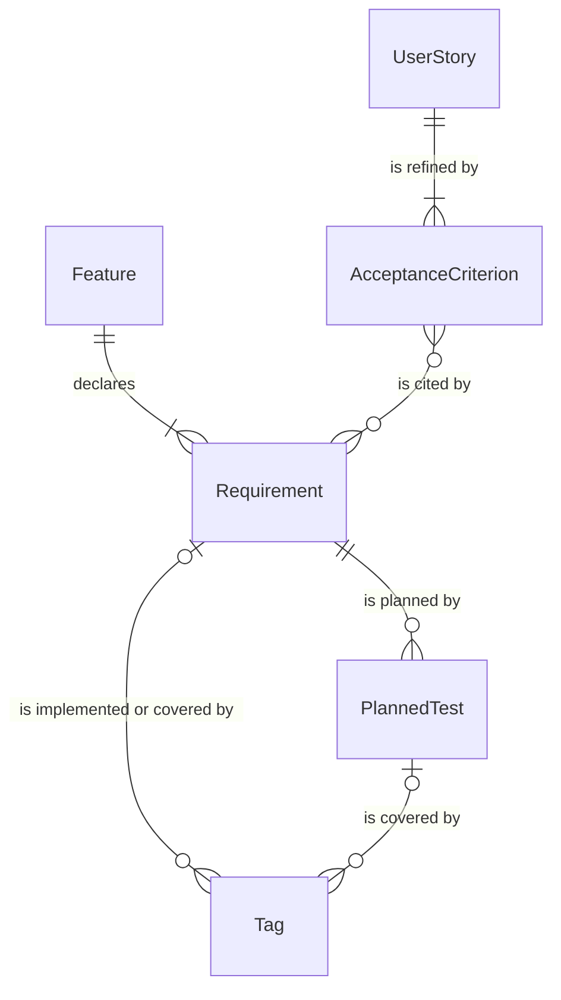

# Entity Dictionary: SDLC AI Plugin

The traceability chain the validator enforces. These are the artifacts a target project accumulates, not database tables. All of them live in Markdown or in code comments.

## Entities

### UserStory
| Field | Type | Constraints | Description |
|-------|------|-------------|-------------|
| id | string | `US-\d+`, project-unique, immutable | Defined in `.sdlc/requirements/problem-brief.md` |

### AcceptanceCriterion
| Field | Type | Constraints | Description |
|-------|------|-------------|-------------|
| id | string | `AC-\d+`, project-unique, immutable | Defined on a list or table line of the brief |
| story_id | string | FK → UserStory.id | The `(US-NNN)` it refines |

### Feature
| Field | Type | Constraints | Description |
|-------|------|-------------|-------------|
| slug | string | `[a-z0-9-]+`, stable | Directory name under `.sdlc/specs/` |
| feature_key | string | `[A-Z][A-Z0-9_-]*`, globally unique | `**Feature Key:**` in `spec.md`; claimed by `.sdlc/keys/<KEY>` |

### Requirement
| Field | Type | Constraints | Description |
|-------|------|-------------|-------------|
| id | string | `REQ-\d+` or `NFR-\d+`, unique within its feature, never recycled | A definition line in `spec.md` |
| feature_key | string | FK → Feature.feature_key | Namespaces the ID: `AUTH:REQ-003` |
| cited_ac_ids | list | each FK → AcceptanceCriterion.id | The `(AC-NNN)` citation, checked when a brief exists |
| status | enum | active / removed | Removed when the text begins `REMOVED (date) — reason` |
| exemption | enum | none / nfr-outside-code / no-in-code-verification | Set only by an exemption heading |

### PlannedTest
| Field | Type | Constraints | Description |
|-------|------|-------------|-------------|
| id | string | `UT-`, `IT-`, `E2E-` or `PBT-\d+`, unique within its feature | A row in the spec's `## Test Plan` |
| requirement_id | string | FK → Requirement.id, must be active | The row's `Req` column |

### Tag
| Field | Type | Constraints | Description |
|-------|------|-------------|-------------|
| kind | enum | IMPLEMENTS / COVERS / @sdlc | Must open a real comment |
| feature_key | string | FK → Feature.feature_key; null = unkeyed (warns, never counts) | |
| target_id | string | FK → Requirement.id or PlannedTest.id | Unknown target = `dangling-tag` ERROR |
| file_path | string | role source for IMPLEMENTS, test for COVERS | Where the tag sits |

## Relationships

## Validation Rules
- Every active, non-exempt Requirement has at least one IMPLEMENTS Tag from a source file and one COVERS Tag from a test file (`trace-code`, `trace-test`).
- Every cited AcceptanceCriterion exists in the brief (`ac-citation`, ERROR). An AC cited by no active Requirement is reported as `ac-uncited` INFO on whole-project runs — usually unspecified backlog, so it never fails `--strict`.
- Every PlannedTest is covered by some COVERS Tag (`plan-test-uncovered`, WARNING) and points at an active Requirement (`plan-stale-row`, `plan-unknown-row`).
- Feature keys are unique (`key-unique`); IDs are unique per feature (`dup-id`) and never both removed and active (`recycled-id`).
