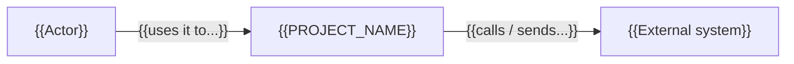
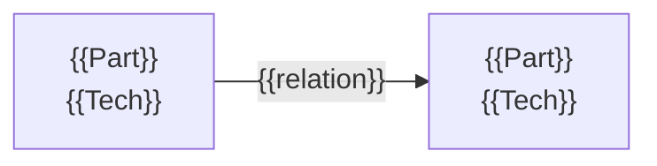
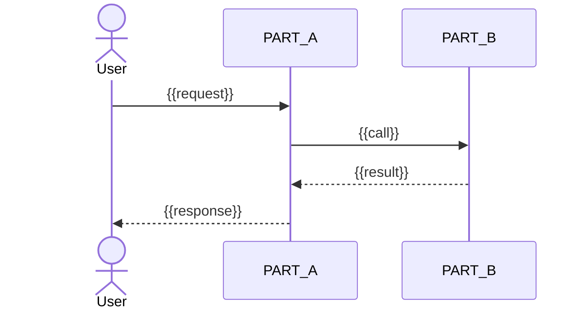

# Architecture: {{PROJECT_NAME}}

*Diagrams are Mermaid — they render on GitHub/GitLab and diff as text. Use `flowchart`, not the experimental `C4Context` syntax. Draw only what the tables below state; a diagram that says more than the text is a second source of truth. Inside a diagram, `{{...}}` appears only in quoted labels; bare names like `PART_A` are placeholders to rename — Mermaid cannot parse braces there.*

## System Context
*Who uses the system and what it talks to. Applies to every project shape.*

## Structure — {{view name}}
*Pick the ONE view that matches the project's shape (from `tech.md`), name it in the heading, and delete this table. C4 containers only fit systems made of separately running programs; forcing them onto a library or a monolith draws boxes nobody deploys.*

| Project shape | View | What the boxes are |
|---|---|---|
| Web app / services | Containers (C4 Level 2) | separately running programs and data stores; arrows are protocols |
| Monolith | Modules / layers | packages or layers; arrows are allowed dependencies |
| Library / SDK | Public modules | exported modules; arrows are dependencies |
| CLI tool | Commands | commands and the modules each one drives |
| Data / ETL pipeline | Pipeline | sources, stages, sinks; arrows are data movement |
| IaC / platform | Deployment topology | networks, clusters, managed services |
| Plugin / prompt pack | Artifact lifecycle | where each artifact lives and which copy is authoritative |

| Part | Technology | Responsibility |
|------|-----------|----------------|
| {{Name}} | {{Tech}} | {{Role}} |

## Components
*Tables only — the inside of each part above. At this level a diagram is usually a picture of the table.*

### {{Part}}
| Component | Responsibility | Dependencies |
|-----------|---------------|-------------|
| {{Name}} | {{Role}} | {{Deps}} |

## Key Decisions
| ADR | Title | Status |
|-----|-------|--------|
| ADR-{{N}} | {{Title}} | {{Status}} |

## Key Flows
*One sequence diagram per flow that crosses parts and that a reader could get wrong — typically 1–3. Per-endpoint detail belongs in the feature's `spec.md`, not here. Entity relationships belong in `.sdlc/requirements/entity-dictionary.md`, not here.*

### {{Flow name}}

## Deployment
*Include only the environments that actually exist (per `.sdlc/docs/test-strategy.md`). Do not invent Staging / Canary.*

| Environment | Infrastructure | Strategy |
|-------------|---------------|----------|
| {{EnvName}} | {{Infra}} | {{Strategy}} |
