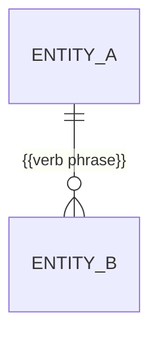

# Entity Dictionary: {{PROJECT_NAME}}

## Entities

### {{EntityName}}
| Field | Type | Constraints | Description |
|-------|------|-------------|-------------|
| {{field_name}} | {{type}} | {{constraints}} | {{desc}} |

## Relationships
*The ERD is the single statement of relationships — no parallel table. Entity names match the headings above; fields stay in the tables, so the diagram carries only keys. Cardinality: `||` exactly one, `o|` zero or one, `|{` one or more, `o{` zero or more. Replace `ENTITY_A`/`ENTITY_B` with the PascalCase entity names — Mermaid cannot parse `{{...}}` outside a quoted label.*

## Validation Rules
- {{Rule}}
